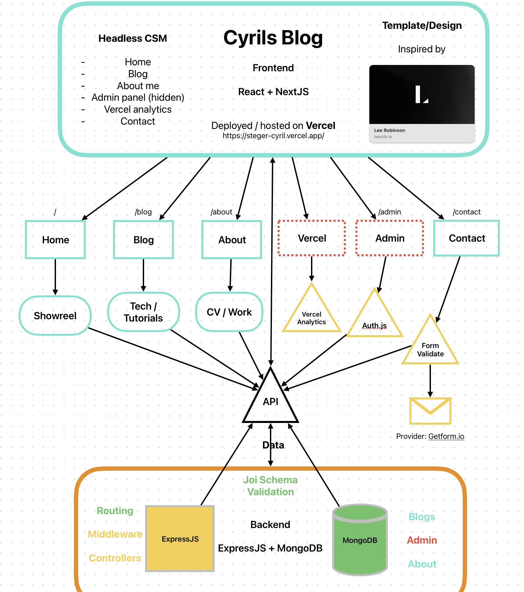

# Cyrils Blog

## Overview

Welcome to Cyrils blog, a personalized portfolio website made by Me. This project is a result of my fullstack developer course by [Robot Dreams](https://github.com/nightguarder/RobotDreams)

## Structure

- **Home** Show reel of my work and social.
- **Portfolio** About me and Contact section.
- **Blog posts** Read articles offering unique insights and perspectives.
- **Image** Images from Behance page *Implement later...*
- 
## Technologies Used

- **NextJS** [NextJS](https://nextjs.https://nextjs.org)
- **React** [React](https://react.dev)
- **ExpressJS** [ExpressJS](https://expressjs.com)
- **MongoDB** [MongoDB](https://www.mongodb.com)
- **Vercel** [Deployed Vercel](https://vercel.com)

## Features
- **CSM Page** Navigate through the page with ease.
- **TailwindCSS** Design with [Vercoly](https://versoly.com/versoly-ui) library
- **Joi Schema** Validating forms, data with Joi [Joi Schema Validation](https://joi.dev)

## TODO:

- [ ] Deploy on Vercel
- [ ] Prismic website builder
- [ ] Connect to MongoDB

The easiest way to deploy your Next.js app is to use the [Vercel Platform](https://vercel.com/new?utm_medium=default-template&filter=next.js&utm_source=create-next-app&utm_campaign=create-next-app-readme) from the creators of Next.js.

Check out our [Next.js deployment documentation](https://nextjs.org/docs/deployment) for more details.
